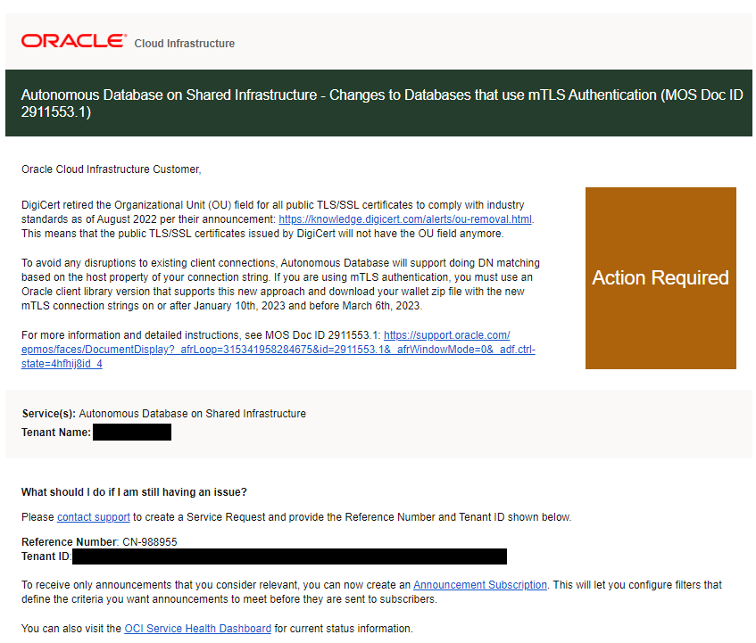
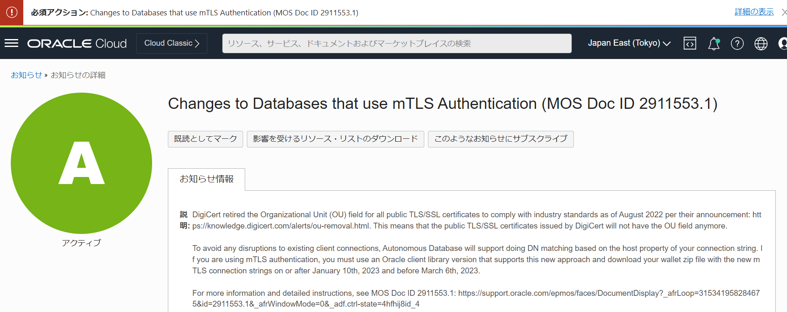

# <span style="color: brown; ">■ お知らせ※2023年1月更新</span>
<br/>

現在Autonomous Database – Sharedへクライアント資格証明(ウォレット)を使用してDB接続を行っているユーザーは、2023/3/6までに新しいウォレットを再ダウンロードする必要があります。
既存のウォレットでは、アプリケーション、ツール、サービスが、2023/3/6以降Autonomous Database インスタンスに接続できなくなります。

ウォレットを使わないTLS接続でDB接続を行っているユーザーは、接続文字列の更新が必要な場合がありますのでご確認ください。
+ 以下のようなOUフィールドの含まれていない接続文字列(新形式)を使用している場合、対応不要です
+ 2022年8月以降OCIコンソールもしくはAPI経由で取得可能な接続文字列は下記の新形式です

`(description=(retry_count=20)(retry_delay=3)(address=(protocol=tcps)(port=1521)(host=adb.region.oraclecloud.com))
(connect_data=(service_name=u9adutfb2ba8x4d_database_medium.adb.oraclecloud.com))(security=(ssl_server_dn_match=yes)))`

+ 以下のようなOUフィールドの含まれている文字列(旧形式)では、3月6日以降接続ができなくなります
+ 2022年8月以前に取得した接続文字列は下記の旧形式です

`(description= (retry_count=20)(retry_delay=3)(address=(protocol=tcps)(port=1521)(host=adb.region.oraclecloud.com))
(connect_data=(service_name=u9adutfb2ba8x4d_database_medium.adb.oraclecloud.com))
(security=(ssl_server_cert_dn="CN=adwc-preprod.uscom-east-1.oraclecloud.com, OU=Oracle BMCS US,O=Oracle Corporation, L=Redwood City, ST=California, C=US")))`

+ OUフィールドの含まれている接続文字列を使用している場合、OCIコンソールもしくはAPI経由でOUフィールドの含まれていない新しい接続文字列を取得し、そちらに変更が必要です。

2023年1月5日頃、Autonomous Database - Sharedをお使いのテナント管理者に以下のようなメールが送信されています。



## DB接続でウォレットを利用しているユーザーが必要な対応
1. Oracle Clientを以下のバージョン以降であることを確認：新しいウォレットでの接続形式のサポートのため
    + アップデートが必要な場合にはご対応ください。
    + Oracle Instant Client/Oracle Database Client: 11.2.0.4.220719 (またはそれ以降), 18.19 (またはそれ以降), 19.2 (またはそれ以降), 21 (ベースリリースまたはそれ以降)
    cx_Oracle, node-oracledb, godror, PHP OCI8, PHP PDO_OCI, ruby-oci8, ROracle, rust-oracleなどのOracle Database ドライバについては、上記のOracle Instant Client/Oracle Database Client バージョンで使用してください
    + ODP.NET: 12.1（2022年4月以降WINDBBP、Managed ODP.NETのみ）、18（ベースリリース以降）、19.4（以降、19.10を除く）、21（ベースリリース以降）
    + JDBC Thin: 11.2.0.4 (またはBug 28492769 に対する単発パッチ適用後)、12.2 (またはBug 28492769 に対する単発パッチ適用後)、18 (ベースリリースまたはBug 28492769 に対する単発パッチ適用後)、19 (ベースリリース後)、21 (ベースリリースまたはそれ以降)
    + Python: python-oracledb 1.0 (またはそれ以降)

1. 2023年1月10日から2023年3月6日までの間にクライアントで使用するウォレットを差し替え
※ウォレットのローテーションは不要です。OCIコンソールよりウォレットを新たにダウンロードし、各クライアントに再配布してください。
設定方法は[こちら](https://oracle-japan.github.io/ocitutorials/database/adb104-connect-using-wallet/)をご参照ください。

+ 上記の対応が難しい場合、設定によってはウォレットを使用しないTLS接続に変更することも可能です

こちらの資料もご確認ください。

<div style="max-width:768px">

<!-- Speakerdeckから Embeded リンクを取得して貼り付け (ここから) -->
<script async class="speakerdeck-embed" data-id="270b8fb99c8a4acd9fd98a7a04748826" data-ratio="1.77777777777778" src="//speakerdeck.com/assets/embed.js"></script>
<!-- Speakerdeckから Embeded リンクを取得して貼り付け (ここまで) -->

</div>

## 本件はウォレットを使うその他のOracle Cloud InfrastructureのOracle DB PaaSサービスも対象ですか？

いいえ、Autonomous Database on Shared Infrastructureのみが対象です。

<br/>

## ウォレットのローテーションが必要ですか？

いいえ、ローテーションは必要ありません。
ウォレットの再ダウンロードを行い、クライアントに設定してください。

<br/>

## ウォレットの差し替えを行わないとどんな影響がありますか？

2023/3/6以降Autonomous Databaseに接続できなくなります。

<br/>

## 本件についてのMOS Noteはありますか？

[こちら](https://support.oracle.com/epmos/faces/DocumentDisplay?id=2911553.1)をご確認ください。

<br/>

## OCIのコンソール画面に**必須アクション：**Changes to Databases that use mTLS Authentication (MOS Doc ID 2911553.1) と表示されていますが、これは本件と関係ありますか？

はい、本件はOCIの**お知らせ**でもアナウンスされています。



<br/>

## なぜ使用可能なクライアントのバージョンの制限があるのでしょうか？

Autonomous Databaseは、mTLS接続文字列のssl_server_cert_dnプロパティに基づいてサーバーのDNマッチングを行っていましたが、このプロパティにはOrganization Unit(OU)フィールドが含まれています。今回、業界水準に準拠し、OUフィールドが使用不可になったため、サーバー側証明書からOUフィールドを削除しました。

Autonomous Databaseは、今後は接続文字列のhostプロパティに基づいてDNマッチングを行うことをサポートします。このアプローチをサポートしているクライアントのバージョンにアップデートする必要があります。

<br/>

## サポートされるODP.NETは12.1のみ記載されていますが、12.2を使用している場合は、バージョンアップが必要ということですか？

はい、12.1限定となりますので、12.2をお使いの場合は19.4以降のバージョンへのバージョンアップが必要になります。

<br/>

## 今すぐにはクライアントのバージョンアップが難しいです。リストにないバージョンのクライアントでも接続はできますか？

基本的にはリストにあるバージョンのクライアントをお使いいただくことを推奨しております。しかし、リストにない11gや12cのクライアントでもバージョンによっては、接続可能なケースがございます。

今すぐのバージョンアップが難しい場合は、後のFAQで示している対応によってそれらのバージョンでお使いいただくことも可能ですが、運用上何か不具合が起きた際にSR等でお問合せいただいても、解決策としてクライアントのバージョンアップをまずはお願いする可能性があります。

<br/>

## ウォレット差し替え後、リストにないバージョンのクライアントから接続しようとすると、エラーが出て、接続ができなくなりました。

先のFAQにもある通り、基本的にクライアントのバージョンアップにてご対応をお願いいたします。対応が難しければ、以下の回避策がございます。

+ ADBのネットワーク・アクセスが`すべての場所からのセキュア・アクセス`もしくは`許可されたIPおよびVCN限定のセキュア・アクセス`の場合
    
    以下の手順をお試しください。それでもなおエラーが出る場合は、クライアントのバージョンアップのご対応をお願いいたします。

1. ADBインスタンスをTLSとmTLS認証の両方を許可する設定に変更します。ドキュメントは[こちら](https://docs.oracle.com/cd//E83857_01/paas/autonomous-database/adbsa/support-tls-mtls-authentication.html)

1. sqlnet.oraとtnsnames.ora内のssl_server_dn_matchをyesからnoに変更

+ ADBのネットワーク・アクセスが`プライベート・エンドポイント・アクセスのみ`の場合

    sqlnet.oraとtnsnames.ora内のssl_server_dn_matchがnoになっていることを確認します。それでもなおエラーが出る場合は、クライアントのバージョンアップのご対応をお願いいたします。

## プライベート・エンドポイント・アクセスのみのADBから、プライベート・エンドポイント・アクセスのみのADBへのデータベース・リンクを構成しています。ウォレットの差し替え後、`ORA-29002：SSL transport detected invalid or obsolete server certificate.`というエラーが出ます。

今回のウォレットの差し替えに際して、ご指摘の構成のデータベース・リンクではウォレットを使った接続がサポートされなくなりました。その構成でデータベース・リンクを使用する場合、ウォレットを使わない接続の利用を検討してください。詳細は[こちら](https://docs.oracle.com/en/cloud/paas/autonomous-database/adbsa/database-links-oracledb-private.html#GUID-67B611A2-2866-49F2-A580-0D6A6EE83A04)をご参照ください。

<br/>

# <span style="color: brown; ">■ サービス概要編</span>
<br/>

## Autonomous DatabaseではExadataのモデルを選択できますか？

Share型とDedicated型で異なります。  
Shared型ではモデルを選択することはできません。ExadataのSmartScanといったハードウェアのスペックに依存しないソフトウェアの機能による高速化がありますので、モデルを気にせずにお使いいただけます。それもメリットの一つです。  
一方、筐体を専有してご利用いただくDedicated型の場合は、利用できるOCPU/ストレージの総量にも関係しますので、Exadata X7またはX8といったようにモデルをご選択いただくことが可能です。

<br/>

## Autonomous JSON Database(AJD) は ACID が保証されているのでしょうか？もしくは一般的なNo-SQL サービスと言う理解でしょうか？

ACIDが保証されているサービスとなります。
良くMongoDBと比較されますが、Autonomous JSON DatabaseはOracle Databaseにドキュメントを格納するため、RDBMSの特徴をそのまま享受できる点がMongoDBと異なる最大の特徴となります。
詳細については[こちら](https://speakerdeck.com/oracle4engineer/autonomous-json-database-ji-shu-gai-yao?slide=6)に記載がありますので、併せてご確認ください。

<br/>

## (APEX)ADB上のOracle REST Data Serviceで作成したAPIはどうやって認証するでしょうか?

[こちら](https://docs.oracle.com/cd/F25233_01/aelig/developing-REST-applications.html)のドキュメントに認証に関する記載がありますので、ご一読くださいますようお願いいたします。
* 3.3 RESTfulサービスへのセキュアなアクセスの構成
* 3.3.5 チュートリアル: リソースの保護およびアクセス

<br/>

## Autonomous JSON Database(AJD)からAutonomous Transaction Processing(ATP)への変更はできますか？ 

はい、できます。ATPからAJDへの変更は不可、またADWへの変更は不可です。
同様にAPEX Application Development(APEX)からATPへの変更は可能ですが、ATPからAPEXへの変更は不可、またADWへの変更も不可です。

[ページトップに戻る](#)

<br/>

# <span style="color: brown; ">■ 課金/ライセンス</span>
<br/>

## OCPU、ストレージの課金は時間単位でしょうか？

[価格表](https://www.oracle.com/jp/cloud/price-list.html#adw)にはストレージはTB/月、CPUはOCPU数/時で記載されていますが、 実際はどちらも秒単位の請求となります。OCPU、ストレージ共に最低1分から秒単位での利用が可能です。  

<br/>

## Auto Scaling 有効時の課金について教えてください

分単位でCPU使用率を算出し、それを時間で平均したものが課金されます。少数点以下は切り上げとなります。例えば、ベースが4 OCPUでAuto ScalingをONにすると最大12 OCPUとなり、1時間あたりの平均消費OCPUが60%であれば8OCPU分が課金されます。

<br/>

## Auto Scaling を有効にした場合のCPU単価は割高になりますか？

いいえ、同一価格となります。

<br/>

## SE BYOLで既存ライセンスを持ち込む場合、1インスタンスあたり8OCPUの上限があります。Auto Scalingを有効にした場合、OCPUはいくつが上限になりますか?

ライセンスタイプは「ライセンス持込み (BYOL)」エディションを「Oracle Database Standard Edition(SE)」を選択してください。その場合、設定できるOCPU数は8まで、またAuto Scalingが利用された場合もBYOLの1インスタンスの最大である8 OCPUで頭打ちとなります。
9OCPU以上の環境にしたい場合は、SE BYOLは利用できません。ライセンス・タイプをBYOLから「ライセンス込み」に変更してご利用ください。
こちらの操作もオンラインで実施できます。ただし、この場合は全OCPUがライセンス込みの価格になりますので、ご注意ください。

<br/>

## Oracle Analytics Desktop （旧Data Visualization Desktop : DVD）は無償でしょうか？

Autonomous Databaseをデータソースとしてご利用いただく限り無償です。[PaaS and IaaS Universal Credits Service Descriptions](http://www.oracle.com/us/corporate/contracts/paas-iaas-universal-credits-3940775.pdf)に以下の記載があります。  
"Your use of Oracle Autonomous Data Warehouse Cloud Service entitles You to any number of users of Oracle Data Visualization Desktop"  
なお、インストールする各PCにはクレデンシャル(暗号キー)の配布・設定が必要です。


<br/>

[ページトップに戻る](#)

<br/>

# <span style="color: brown; ">■ 構成関連</span>
<br/>

## インフラ構成やI/O帯域、搭載メモリなどのスペックは公開されていますか？

詳細なアーキテクチャ、スペックは公開しておりません。それらの管理・運用の手間からユーザを開放することがAutonomous Databaseのコンセプトです。  
I/OスループットはCPUの数に合わせてスケーリングします（Disk、FlashのI/O帯域がcpu_countの値に比例するよう制御されています）。
またメモリもOCPUに比例する形で割り当てられます。

<br/>

## I/O性能の指標はありますか？

具体的な指標はありません。Autonomous DatabaseはExadataで構成されていますが、ExadataはI/Oを効率化する各種機能があり、単純なI/O能力だけでは性能を判断できないからです。実際にご利用いただいているお客様の評価を[事例サイト](https://www.oracle.com/jp/cloud/infrastructure/case-studies/)でご確認ください。

<br/>

## ストレージの最大容量はどのように制御されているのでしょうか、また指定できる最大容量はいくつでしょうか？

指定した容量に基づいてデータベースのプロパティで設定がされます。設定は以下で確認できます。  

```sql
SQL> select PROPERTY_VALUE FROM database_properties WHERE property_name = 'MAX_PDB_STORAGE';
SQL> select max_size from v$pdbs;  
```
指定できる最大容量は128TBです。それ以上のサイズが必要な場合は別途お問い合わせください。

<br/>

## ストレージ容量として指定したサイズはデータベース全体のサイズでしょうか、それとも格納するデータ量に対してでしょうか？

データベース全体のサイズです。ユーザーデータを格納する表領域以外のデータベースを稼働させるために必要な表領域も含まれます。
含まれる表領域については[Autonomous Database Cloud 技術詳細](https://speakerdeck.com/oracle4engineer/autonomous-database-cloud-ji-shu-xiang-xi)の"ストレージ領域の管理"の章をご確認ください。

<br/>

## ストレージ容量以上のデータを格納しようとした場合はどうなりますか？ 

ストレージ容量が不足した場合は、Insert処理がエラーとなります（ORA-65114: コンテナ内の領域の使用量が高すぎます）  
ただし、サービスコンソールの使用率表示は余裕を持たせてあり、100%ではなく、110%でエラーが発生するようになります。
この場合、ストレージ容量を手動でスケールアップする、もしくはストレージの自動拡張機能を有効にすることでエラーを解消できます。ストレージの自動拡張を有効にすると、ストレージ量が100GB以下になると1TBずつ設定値の3倍まで自動で拡張します。

<br/>

## OCPUのAuto Scalingと手動スケーリングは同時に利用できますか？

同時に利用することができます。Auto Scalingを有効にした状態で、OCPU数を手動で調整することが可能です。

<br/>

[ページトップに戻る](#)

<br/>

# <span style="color: brown; ">■ 可用性関連</span>
<br/>

## ディザスタリカバリ（DR/Disaster Recovery）は可能でしょうか？

可能です。Autonomous Data Guardをリージョン内（ローカル）、クロス・リージョンで構成することができます。

<br/>

## 障害が発生した場合の復旧時間について教えてください。

ハードウェア障害やデータ破損発生時の障害復旧時間は[こちら](https://docs.oracle.com/en/database/oracle/oracle-database/19/haovw/oracle-maximum-availability-architecture-and-autonomous-database-cloud.html#GUID-92064893-D689-4450-B491-3042A5AFCE2B)をご確認ください。サービスとしては可用性SLA99.95%で提供されます。  
Autonomous Data Guard を構成いただいた場合は、SLA99.995%となり、データ破損などの障害からの復旧時間が短くなります。RTO/RPOについては[マニュアル](https://docs.oracle.com/ja-jp/iaas/adbdataguard/autonomous-data-guard-about.html#GUID-AF736587-4F6D-45C3-9886-7211B0A33745)をご確認ください。

<br/>

## 東日本-西日本などリージョン間を跨いだ冗長化を検討する場合、もっともRTO/RPOを短くすることができる構成はどのようになりますでしょうか？ 

Autnomous Data Guardを利用した構成をご検討いただけます。RTO/RPOについては[マニュアル](https://docs.oracle.com/ja-jp/iaas/adbdataguard/autonomous-data-guard-about.html#GUID-AF736587-4F6D-45C3-9886-7211B0A33745)に記載があります。他の方法として、GoldenGateを利用した論理レプリケーションがあります。それぞれについてチュートリアルを公開しておりますのでご利用ください。

* [Autonomous Data Guardチュートリアル](https://oracle-japan.github.io/ocitutorials/database/adb212-audg/)
* [OCI GoldenGateチュートリアル](https://oracle-japan.github.io/ocitutorials/database/adb401-oci-goldengate/)

<br/>

## バックアップは開始時点でスナップショットが取得されるのでしょうか？その場合、バックアップの完了を待たずともDDL/DML/起動停止等の操作は可能ですか。  

Autonomous Database は、ストレージ装置のスナップショット機能によるバックアップは採用しておらず、RMANを利用して60日ごとにフルバックアップ、週次で累積バックアップ、日次で増分バックアップを取得しております。増分バックアップの間の更新についてはアーカイブ・ログが取得されております。 これらのバックアップとアーカイブ・ログを利用することで、バックアップ保持期間の60日の間であれば任意のタイミングに戻すことが可能です（Point-In-Timeリカバリ）。
従いまして、バックアップの断面を気にしていただく必要はありません。 ただし、Autonomous Database のリカバリは秒指定で行うため、断面でのリカバリが必要な場合は、アプリケーション側で静止点を確保し、その時間を指定してリカバリを行ってください。
また、Autonomous Database には自動バックアップと合わせて手動バックアップという機能もあります。こちらをご利用いただくと指定したタイミングでフルバックアップを取得いただくことが可能です。自動バックアップはリストアする際に任意のタイミングに変更ログ（アーカイブ・ログ）を適用しリカバリする必要がありますが、手動バックアップは特定の時点のリストアのみで、リカバリする必要がありませんので、比較的高速に復旧いただくことが可能です。手動バックアップはAPI経由でのみ実行可能です。(※2022/12現在)

[参考マニュアル Autonomous Databaseのバックアップおよびリストア](https://docs.oracle.com/cd/E83857_01/paas/autonomous-database/adbsa/backup-restore.html#GUID-9035DFB8-4702-4CEB-8281-C2A303820809)

<br/>

## 自動バックアップはどこに取得されるのでしょうか。任意のオブジェクト・ストレージに取得することはできますか？ 

オラクル社が管理するオブジェクト・ストレージに取得されます。取得先に任意のオブジェクト・ストレージを指定することはできません。自動バックアップが取得されるオブジェクト・ストレージはユーザがアクセスすることはできず、課金対象外（ユーザーが指定するストレージ容量には含まれません）になります。  
なお、手動バックアップの場合は任意のオブジェクトストレージの指定が可能です。

<br/>

## Autonomous Database Shared型の自動バックアップのタイミングは指定できますか？

現時点でタイミングを指定することはできません。
なお、取得したバックアップの情報は下記SQLで確認いただくことが可能です。

```sql
ALTER SESSION SET NLS_DATE_FORMAT = 'RR/MM/DD HH24:MI:SS';

SELECT 
    TAG, 
    MIN(START_TIME), 
    MAX(COMPLETION_TIME), 
    (MAX(COMPLETION_TIME)- MIN(START_TIME))*24*60 as Minutes, 
    SUM(BYTES)/1024/1024/1024 "Size(GB)"
FROM V$BACKUP_PIECE
WHERE DEVICE_TYPE='SBT_TAPE' AND STATUS='A'
AND (TAG LIKE 'TAG_C1%' OR TAG LIKE 'TAG_L1%' OR TAG LIKE 'TAG_AL%' OR TAG LIKE 'PDB_%')
AND START_TIME >= TO_DATE('2021-04-05 00:00:00', 'yyyy-mm-dd hh24:mi:ss')
GROUP BY TAG
ORDER BY MIN(START_TIME)
;
```
TAG列の先頭の値でバックアップタイプが判断できます。
* TAG_C1 : フルバックアップ（週次）
* TAB_L1 : 増分バックアップ（日次）
* TAB_AL : アーカイブログ（毎時）

<br/>

## 自動バックアップからのリストア時間はどれくらいでしょうか？

データ量、更新量に依存するため変動する可能性はありますが、サービスレベル目標については[こちら](https://docs.oracle.com/en-us/iaas/autonomous-database-shared/doc/availability-slo.html)を参照ください。

<br/>

## バックアップを任意の場所にリストアすることや、BaseDBなど別のサービスに展開することは可能ですか？

できません。Autonomous Database のバックアップは、同じデータベースにリストアしてデータを復元する目的にのみ使用できます。
バックアップからではなく、Data Pump でオブジェクト・ストレージにエクスポートし、別のサービスへインポートを行うことや、クローン機能でクローンやリフレッシュ可能なクローンを別のコンパートメントに作成することをご検討ください。

<br/>

## Autonomous Database Shared型はソースDBを止めずにクローンできると思いますが、どの断面で作成されるのですか？作成をクリックしたタイミングですか？ 

クローン実行中のどこかのタイミングが断面となります。クリック直後といった明確な基準は定義されておりません。  
明確に断面を確保したい場合はアプリケーション側で読み取り専用（Readonly)として更新が入らないように制御する、またはインスタンスを停止してのクローン、バックアップを利用して時間指定でのクローンをご利用ください。  
なお、バックアップから作成する場合はオブジェクトストレージからのインスタンス作成になるため、クローン作成は比較的時間がかかることにご注意ください（データ量、圧縮率に依存）

[参考：クローンに関するチュートリアル](https://oracle-japan.github.io/ocitutorials/database/adb211-clone/)

<br/>

## Data Pump を利用した論理バックアップはできますか？ 

はい、できます。スキーマ単位、表単位でバックアップを取っておきたい場合に利用します。
詳しい手順はこちらのマニュアルをご参照ください。

[参考：Data Pumpを使用したAutonomous Databaseでのダンプ・ファイル・セットの作成](https://docs.oracle.com/cd/E83857_01/paas/autonomous-database/adbsa/export-data-create-dump-file.html#GUID-8D734C1A-FAF3-446C-B777-16DF62FB049E)

<br/>

## セッションの瞬断対策として何か講じることはできますか？ 

Application Continuityを有効化することで、セッション瞬断の影響を受ける処理を自動回復させることができます。接続サービスごとに有効化するだけでアプリからは透過的に利用することができます。詳しい手順はこちらのチュートリアルをご参照ください。

[参考：Application Continuityを設定しよう](https://oracle-japan.github.io/ocitutorials/database/adb213-tac/)

<br/>

[ページトップに戻る](#)

<br/>

# <span style="color: brown; ">■ 接続・データロード/連携関連</span>
<br/>

## Autonomous Databaseに接続がサポートされている製品(サードパーティ製品)を教えてください。

サポートについては接続を行う製品ベンダー側にご確認いただくことになります。
[オラクル社で動作確認したツールのリスト](https://www.oracle.com/jp/autonomous-database/tools/)
もありますが、リストに記載がなくてもOracle Clientの要件を満たしていれば基本的に動作可能とお考え下さい。  

<br/>

## Autonomous Databaseに割り当てられたIPアドレスは固定でしょうか。

Private IPは固定ですが、Public IPは変更される可能性があります。Public IPの場合はホスト名をご利用ください。

<br/>

## Autonomous Databaseの同時接続セッション数はいくつでしょうか。また同時接続セッション数を超えて接続しようとした場合はエラーになりますか？

同時接続セッション数は1OCPUあたり300セッションです。  
Autonomous Databaseの初期化パラメータSESSIONSとして設定されます。この値は接続サービスをまたいで有効であり、例えば、OCPU=1のAutonomous Transaction Processingにおいて、TPURGENTで100、TPで200セッションが接続している場合、新たにセッションを作成することはできません。セッション数を超えた場合は 「ORA-00018: 最大セッション数を超えました」というエラーとなり、セッションの作成に失敗します。  
なお、Autonomous DatabaseはOracle MultitenantのPluggable Databaseであるため、バックグランドプロセスや再帰セッション分のセッション数を考慮する必要はありません。

<br/>

## Autonomous Databaseで動作しているトランザクション系システムのデータを分析系システムへ渡したい場合、なるべく低負荷でデータを伝搬させる手段はありますでしょうか？ 

OCI GoldenGateの利用をご検討ください。またDatabase Linkをご利用いただくことも可能です。  

[参考：OCI GoldenGateチュートリアル](https://oracle-japan.github.io/ocitutorials/database/adb401-oci-goldengate/)

<br/>

## IoTデータ等の大規模ファイルを扱う場合、外部表を利用してオブジェクト・ストレージに配置して都度アクセスするか、一旦Autonomous Database内にロードしてから利用するのとではどちらが良いでしょうか？ 

ケース・バイ・ケースですが、参照頻度によって決めることをおすすめします。  
SQLでの参照頻度が低いようであれば、オブジェクト・ストレージの方がAutonomous DatabaseのExadata Storageよりも安価ですので、外部表を利用してアクセスするほうがコストを抑えることができます。
また頻繁にアクセスするようでしたらAutonomous Database内にロードした方が、SmartScan機能による高速化を有効に利用できます。  
なお、外部表を利用して参照する場合も、Autonomous Databaseにロードする場合も、オブジェクト・ストレージ上のファイルは分割しておくことをおすすめします。ファイルを分割することで複数のコアを利用した高速な並列処理が可能になります。

[参考：Autonomous Databaseを使用した外部データの問合せ](https://docs.oracle.com/cd/E83857_01/paas/autonomous-database/adbsa/query-external.html#GUID-ABF95242-3E04-42FF-9361-52707D14E833)

<br/>

## Autonomous Database とOracle Database 以外のデータベースの連携は可能ですか？ 

Oracle Database Gatewayを経由することでDB Linkで連携可能です。Redshift、MySQL EE、PostgreSQL、SnowflakeなどいくつかのデータベースへのDB Linkでは、Oracle Database Gatewayを用意しなくとも利用可能です。参照するリモートDBにはいくつか要件がございます。詳しくはこちらのマニュアルをご参照ください。

[参考：非Oracle Databaseへのデータベースリンクの作成](https://docs.oracle.com/cd/E83857_01/paas/autonomous-database/adbsa/autonomous-database-links-non-oracle-db.html#GUID-6C925566-2067-4D3B-A3FF-CA73C60506C9)

<br/>

[ページトップに戻る](#)

<br />

# <span style="color: brown; ">■ セキュリティ関連</span>
<br/>

## ウイルスソフトは導入できますか？
　
OSレイヤーは解放していないため、ウィルスソフトのインストールはできません。オラクル社にて対策を十分に講じておりますので、お客様側で対応いただく必要はございません。

<br/>

## ハッキングや、ウィルス対策はどの様になっていますでしょうか？
　
オラクル社にて対策を十分に講じております。セキュリティ・ポリシーに関しては[セキュリティガイド](https://docs.oracle.com/cd/E97706_01/Content/Security/Concepts/security_guide.htm)を参照ください。

<br/>

## 暗号化は必須ですか？ 

はい、必須です。  
Autonomous Databaseではデータファイル（表領域）やバックアップファイル、およびネットワークなど、全てのレイヤーにおいてデフォルトで暗号されております。これらの暗号化にはAdvanced Security Option(ASO）を利用しております。ASOはオンプレミスでは有償オプションですが、Autonomous Databaseを含むOCIのPaaSサービスではサブスクリプションの範囲として追加費用なくご利用いただけます。

<br/>

## Autonomous Databaseの表領域暗号化のアルゴリズムは何を利用していますか? 

2022/12時点でAES-256で暗号化されております。
V$ENCRYPTED_TABLESPACESビューを参照いただくことで確認可能です。

```sql
SELECT NAME,ENCRYPTIONALG FROM V$ENCRYPTED_TABLESPACES a,V$TABLESPACE b
WHERE a.TS# = b.TS#
```

<br/>

## Autonomous Databaseの通信はTLS1.2ですか？

はい、TLS1.2です。[Oracle Autonomous Databaseの職責モデル](https://docs.oracle.com/cd/E83857_01/paas/autonomous-database/shared-responsibility-model.html)のアプリケーション・セキュリティの欄に記載があります。

<br/>

## ADBでデータベース監査の結果はすべてコマンドで取得できますか？ 

はい、Oracle Databaseの統合監査機能ですので、UNIFIED_AUDIT_TRAILビューでご確認いただくことが可能です。なお、GUIで参照するには、Data Safeをご利用ください。  

[参考：Oracle Data Safeチュートリアル](https://oracle-japan.github.io/ocitutorials/intermediates/data-safe-tutorials/)

<br/>

## Autonomous Databaseにおいてマスキングする場合、プロシージャ等で実行できるのでしょうか？ 

現時点で、Autonomous DatabaseでOracle Data Masking and Subsetting Packは利用できません。マスキングの機能を利用するには、Data Safeをご利用ください。 

[参考：Oracle Data Safeチュートリアル](https://oracle-japan.github.io/ocitutorials/intermediates/data-safe-tutorials/)

<br/>

## 行や列単位でアクセス制御をかけることはできますか？ 

はい、仮想プライベートデータベース(VPD)というソリューションで可能です。詳しくはこちらのチュートリアルをご参照ください。

[参考：Virtual Private Database(VPD)チュートリアル](https://oracle-japan.github.io/ocitutorials/database/adb210-VPD/)

また、特権ユーザーに対しても情報にアクセスさせないようにするDatabase Vaultも設定可能です。詳しくはこちらのチュートリアルをご参照ください。

[参考：Database Vaultチュートリアル](https://oracle-japan.github.io/ocitutorials/database/adb209-DV/)

[ページトップに戻る](#)

<br/>

# <span style="color: brown; ">■ オプション・機能関連</span>
<br/>

## Autonomous Database でSQL計画管理(SPM：SQL Plan Management)は利用できますか？ 

はい、ご利用いただけます。19cから自動タスクの中でパフォーマンスが優れた計画はベースラインに追加されるようになっているため、SPMは自動的に利用されています。また、状況に応じてベースラインの実行計画から、利用する実行計画を選択することも可能です。

* SPMは自動で動いており、ベースラインも自動で取得している
* 手動取得も可能(Session単位でのみ可能。alter system によるOPTIMIZER_CAPTURE_SQL_PLAN_BASELINESの有効化(TRUE)は不可)。

参考：  
[ドキュメント SQL計画管理の概要](https://docs.oracle.com/cd/F19136_01/tgsql/overview-of-sql-plan-management.html#GUID-F1C45056-F998-43E5-B362-83F88DA49E58)  
[ドキュメント Oracle Database SQLチューニング・ガイドのこのリリースでの変更](https://docs.oracle.com/cd/F19136_01/tgsql/release-changes.html#GUID-7F884CC2-24AD-4CB9-B387-84C43BD2B5D9)  
[ホワイトペーパー Oracle Database 19cのSQL計画管理](https://www.oracle.com/technetwork/jp/database/bi-datawarehousing/twp-sql-plan-mgmt-19c-5324207-ja.pdf)

<br/>

## Autonomous Database でSQLプロファイルは利用できますか？ 

SQLプロファイルとは、SQLチューニングアドバイザを利用して生成される補足統計です。
Autonomous Databaseでは自動SQLチューニング（自動タスクによるSQLチューニングアドバイザの実行）は行われておりませんが、オンデマンドでのSQLチューニングアドバイザの実行は可能です。   

参考：  
[ドキュメント：SQLプロファイルの統計](https://docs.oracle.com/cd/F19136_01/tgsql/managing-sql-profiles.html#GUID-0DF775E3-8E88-437F-8A30-1173497EB971)  
[ドキュメント：SQLチューニング・タスクの作成](https://docs.oracle.com/cd/F19136_01/tgsql/sql-tuning-advisor.html#GUID-36E17A9F-7912-483D-A10F-7748BBB924E0)

<br/>

## Autonomous Database でSQLパッチは利用できますか？ 

はい、明示的に与えたいヒントをSQLパッチとして作成し、SQLに適用することができます。  

参考：  
[津島博士のパフォーマンス講座 第72回](https://blogs.oracle.com/otnjp/tsushima-hakushi-72)  
[ドキュメント：DBMS_SQLDIAG](https://docs.oracle.com/cd/F19136_01/arpls/DBMS_SQLDIAG.html)

<br/>

## Autonomous Database でReal Application Testing(RAT)は利用できますか？ 

はい、Real Application Testing(RAT)のSQL Performance Analyzer(SPA)を利用できます。  
Autonomous Databaseへの移行を検討される際やAutonomous Databaseのバージョンアップの際に、個々のSQLの性能調査に有効です。手順は以下のチュートリアルを参照ください。なお、RATのDatabase Replayも利用可能です。

[参考：SQL Performance Analyzer(SPA)チュートリアル](https://oracle-japan.github.io/ocitutorials/database/adb216-patch-spa/)

<br/>

## Autonomous Database でResult Cacheは利用できますか？

はい、利用できます。  
ワークロードの違いに合わせてデフォルト設定がされています。Autonomous Data Warehouse(ADW)は有効、Autonmous Transaction Processing(ATP)は無効です。

<br />

## Autonomous Database でFlashback機能は利用できますか？

Flashback databaseはリストアの際に内部的に利用されていますが、ユーザーが明示的に利用することはできません。
その他のFlashback query, table, drop機能は通常のOracle Databaseと同様に利用可能です。

<br />

## Autonomous Database でHybrid Columnar Compression（HCC/ハイブリッド・カラム圧縮）は利用できますか？

Autonomous Databaseはワークロードにあわせて表領域単位で圧縮レベルがデフォルトで設定されています。

*  Autonomous Transaction Processing(ATP)は非圧縮
*  Autonomous Data Warehouse(ADW)は、HCC（QUERY HIGH ROW LEVEL LOCKINGモード）

表単位で非圧縮やBASIC、OLTP、Query Lowといった圧縮モードへの変更は可能です。
ADWで更新が発生するような表の場合は、明示的に非圧縮に設定してください。

>QUERY HIGH ROW LEVEL LOCKINGモードとは  
>HCCは1CU につき1ロックを使用しますが、Oracle Database 12cから行レベル・ロックの有効化が可能となりました。
>OnP Exadata におけるHCCのデフォルト設定は、NO ROW LEVEL LOCKINGです。

<br />

## Autonomous Database でDatabase In-Memory(DBIM）を利用できますか？

Autonomous Databaseは内部的にExadataのフラッシュ・キャッシュでDataase In-Memory機能を自動的に利用して性能を最適化します。お客様が意図してDatabase In-Memoryの機能を使用することはできません。

<br />

## 一部の重たいクエリによるリソースの大量消費を防ぐ仕組みはありますか？ 

Runaway Queryの管理で、SQLの実行時間やIO量の上限を設定することができます。セッションは接続されたまま、上限を超えるクエリは強制キャンセルされます。

[参考：Runaway Query マニュアル](https://docs.oracle.com/en/cloud/paas/autonomous-database/adbsa/manage-sql-statements.html#GUID-4861BA7F-F9FA-4909-8DC0-4F46AFF80706)

<br/>

[ページトップに戻る](#)

<br />

# <span style="color: brown; ">■ 運用管理・監視関連</span>
<br />

## データファイルのサイズ変更（リサイズ）や最大サイズの変更を行うことはできますか？
はい、できます。DATA表領域のデータファイルに対してリサイズと最大サイズの変更が許可されています。

```sql
--リサイズ
 ALTER DATABASE DATAFILE <FILE_ID> RESIZE <リサイズ後のサイズ>;
-- 自動拡張の最大サイズの変更
 ALTER DATABASE DATAFILE <FILE_ID> AUTOEXTEND ON MAX SIZE <Maxサイズ> ;
```
なお、表領域の作成、削除、表領域の設定値の変更および、デフォルト表領域の変更は許可されていません。
デフォルトで自動拡張が有効化されており、ユーザが指定したストレージ容量の範囲内で自動的に拡張されます。  

<br />

## 権限やリソースの制御はどのようにおこなっているのでしょうか、変更可能でしょうか？

データベースレベルでの権限やリソースの制御はPDBロックダウン・プロファイル機能を利用しています。
Autonomous Database では、PDBロックダウン・プロファイルの設定は変更できません。
設定内容の確認は以下のSQLで可能です。

```sql
SELECT * FROM V$LOCKDOWN_RULES WHERE STATUS LIKE 'DISABLE%' ORDER BY RULE_TYPE ;
```

ユーザーが許されているリソース変更は、接続サービスのリソース割り当て（SHARES）や長時間かかるSQLの自動切断設定などがあります。詳細は[Autonomous Database Cloud 技術詳細](https://speakerdeck.com/oracle4engineer/autonomous-database-cloud-ji-shu-xiang-xi)を参照ください。

[参考ドキュメント PDBロックダウン・プロファイルを使用したPDBでの操作の制限](https://docs.oracle.com/cd/F19136_01/dbseg/configuring-privilege-and-role-authorization.html#GUID-AB5E62DB-7E2A-4B5A-BA96-A2BD2DF15275)

<br />

## AWRは取得できますか？AWRの保持期限、スナップショット間隔は変更で可能でしょうか？

可能です。パフォーマンスハブからのダウンロードまたはSQLで取得できます。取得方法は[OCIチュートリアル](https://oracle-japan.github.io/ocitutorials/database/adb203-bulk-query/#anchor3-2)に記載していますのでご確認ください。
AWRの取得設定は通常のOracle Databaseと同様にDBMS_WORKLOAD_REPOSITORY.MODIFY_SNAPSHOT_SETTINGSにて変更可能ですが、再起動すると保持期間はデフォルトの30日に戻ります。

<br />

## オプティマイザ関連の設定は変更できますか。  

基本的に不可です。全てオプティマイザに任せるのがコンセプトです。Autonomous Databaseの初期化パラメータなどの制限事項ついては[ドキュメント](https://docs.oracle.com/cd/E83857_01/paas/autonomous-database/adbsa/experienced-database-users.html#GUID-58EE6599-6DB4-4F8E-816D-0422377857E5)をご確認ください。

<br />

## 統計情報の固定・リストアは出来ますか。  

統計情報のリストア（DBMS_STATS.RESTORE_TABLE_STATS）、固定化（dbms_stats.lock_table_stats）は可能です。
ただし、Autonomous Database では自動統計収集が有効化されていますので、基本的に全てAutonomous Databaseに任せることが可能です。

<br />

## パフォーマンスハブで確認すると、Consumer Groupに接続サービスのグループ（HIGH/MIDDLE/LOW)のほかにOTHER_GROUPSとInternalがあります。これは何でしょうか。 

Cloud Ops、もしくはスケジューラプロセスが利用するグループです。お客様は利用できません。

<br />

## アラートログ、トレースファイルの確認はできますか。  

SQLを利用してアラートログ(V$DIAG_ALERT_EXT)やトレースファイル(V$DIAG_TRACE_FILE_CONTENTS)を確認することは可能です。[OCIチュートリアル](https://oracle-japan.github.io/ocitutorials/database/adb502-report/)に記載しておりますのでご確認ください。

<br />

## Autonomous Database で監視と通知の設定を行うことは可能でしょうか？ 

はい、可能です。
以下を必要に応じて組み合わせてご利用ください。詳細については[Autonomous Database Cloud 技術詳細](https://speakerdeck.com/oracle4engineer/autonomous-database-cloud-ji-shu-xiang-xi)を参照ください。 
+ OCIにおけるテナント管理者への各種通知（オラクル社が実施する各種メンテナンス等に関して）
+ ADBインスタンス単位で指定する連絡先リストへの通知（オラクル社が実施する各種メンテナンス等に関して）
+ OCI Monitoringの監視メトリックやOCI Eventsにてサポートされるイベントについて通知（OCI Notificationsと連携）
+ Oracle Management CloudやEnterprise Managerを用いた監視・通知

<br />

## SYSDATEのタイムゾーンがUTCですが、JSTに変更は可能でしょうか？

はい、SYSDATE_AT_DBTIMEZONEを使用することで可能です。
以下の記事に手順が記載されていますのでご確認ください。
[[OCI]Autonomous Database：SYSDATE_AT_DBTIMEZONEを使用してsysdateが日本時間を返すようにしてみた](https://qiita.com/500InternalServerError/items/d741a7144de7b35e04ed)

<br />

[ページトップに戻る](#)

<br />

# <span style="color: brown; ">■ パッチ・メンテナンス関連</span>
<br />

## Autonomous Database Shared型は適宜自動でパッチが適用されていくと思いますが、パッチに伴う性能影響が心配です。 

パッチ適用に伴うSQLの実行計画の変動を気にされているかと思いますが、Autonomous Databaseに定期的に自動適用されるパッチについては、オプティマイザの更新はデフォルトOFFのままとなっております。したがって、パッチ適用に伴う実行計画の変動は基本的に発生しません。また強化されたSQL実行計画管理機能（SPM）により実行計画の変化に伴う性能影響が出ないよう自動管理されております。

<br />

## Autonomous Databaseのパッチ適用作業時にインスタンスの起動は必要でしょうか？ 

いいえ、必要ありません。メンテナンス実施時にインスタンスが停止していてもパッチは適用されます。インスタンス停止中に適用できないパッチ(DataPatch等)については、インスタンスが起動した際に適用されるようになっています。

<br />

## 過去のメンテナンスの情報は確認可能でしょうか？

各Autonomous Databaseのメンテナンスについては、コンソールのメンテナンス履歴で確認いただけます。
また、適用されたパッチについては、DBA_CLOUD_PATCH_INFOビューで詳細を取得できます。

```sql
SELECT * FROM DBA_CLOUD_PATCH_INFO;
```

サービスレベルでの過去の緊急メンテナンス等の実績はOCIコンソールのお知らせ(Announcements)をご覧ください。

<br />

## ハードウェア更改時の対応はオラクルが行うのでしょうか。

はい。オラクル社の責任範囲ですので、オラクル社でH/W更改を含むメンテナンスを実施します。  
メンテナンスに伴いインスタンスの稼働に影響が及ぶ場合は、事前にOCIのテナント管理者、およびAutonomous Databaseインスタンスの連絡先リストに記載のメールアドレス宛に通知されます。

<br />

[ページトップに戻る](#)

<br />

# <span style="color: brown; ">■ 性能検証編(環境作成)</span>
<br />

ここではAutonomous Database を利用して検証作業を実施するためのノウハウを中心に記載しています。  
なお、“簡単”というAutonomous のコンセプトから乖離するような細かい内容も含まれていますが、基本的に簡単すぐに良い性能が得られています。

<br />

## OCPUはいくつからスタートすれば良いですか？ 

Autonomous Databaseにおいて性能試験をされる場合、最低でもOCPU=2からスタートしてください。より高い性能を得るためのパラレル処理が利用可能になります。

<br />

## データロードについて、DBMS_CLOUD.COPY_DATAによるデータロードを高速化するには？ 

OCIチュートリアルの[コマンドラインから大量データをロードしてみよう](https://oracle-japan.github.io/ocitutorials/database/adb202-dataload-dbms-cloud/)の「よくある質問」に記載していますのでご参照ください

<br />

## 統計情報はいつ取得すれば良いですか？ 

自動的に取得されているため、考慮不要です。

* Autonomous Database ではデータをロード（ダイレクト・パス・ロード）する際に、自動で統計情報が取得されます
* その後、実際のワークロードに基づいて統計情報が定期的に自動取得されます
* さらに、クエリ実行時に統計情報が欠損している際は、ダイナミック・サンプリングが動きます

それでも期待した性能が出ない場合は、以下のようにコマンドで取得することも可能です。

```sql
exec dbms_stats.gather_table_stats( ownname => ‘YYY’, tabname => ‘XXX’) ;
```

<br />

[ページトップに戻る](#)

<br />

# <span style="color: brown; ">■ 性能検証編(クエリ実行)</span>
<br />

## IOがボトルネックになっている処理の性能向上を図るには？ 

Autonomous Database はOCPU数を増やすことでコア数だけでなくIO帯域も増えるため、IOバウンドな処理に対してもOCPUを増やすことで高速化できます。  
OCPU増はコストに跳ね返ってきますが、OCPUはオンラインでスケールアップ・ダウンが可能なので、週末・夜間など使わないタイミングはコア数を減らすことでコストを削減できます。  

その他、Autonomous Databaseでは高速化のためのオプション機能であるパーティションが追加費用なく利用できます。またマテリアライズド・ビュー機能やAutonomous Transaction Processing(ATP)の場合はHCCによる圧縮も利用できるため（Autonomous Data Warehouse(ADW)はデフォルトで圧縮され格納される）、これらの機能を活用することもご検討ください。

<br />

## ヒントは利用できますか？ 

* Autonomous Transaction Processing(ATP)の場合
    * 通常Oracle Databaseと同様、特に気にせずにヒント句を利用できます。
* Autonomous Data Warehouse(ADW) の場合
    * 基本的にオプティマイザに全て任せることで高速化できるため、ヒントは不要です。
        * optimizer_ignore_hints がTRUEであり既存ヒントは無効化されている
        * ヒントを利用するためにはセッション単位でヒントを有効化する必要があります。（NO_RESULT_CACHEヒントを除く。後述）

        ```sql
        alter session set optimizer_ignore_hints = false ;
        select /*+ xxxxx */ count(1) from test_table ;
        ```


おすすめの検証手順としては、まずはそのままの状態で計測してください。その後、予期した性能が出ない場合に限り、ヒントの効果を確認してください。

<br />

## Result Cache（結果キャッシュ）を無効化することはできますか？ 

Autonomous Data Warehouse (ADW) はDWHの高速化機能の一つであるResult Cacheがデフォルトで有効化されており、あくまでもそのままお使いいただくことを推奨しています。（Autonomous Transaction Processing(ATP)はデフォルト無効です）

とは言え、性能試験にてSQLの処理時間を計測したい場合、Result Cacheが有効だとどんなに時間がかかるSQLでも2回目の計測以降は1秒未満の結果となるため、Result Cacheを無効化したいケースがあります。  
Result Cacheを無効化したい場合は以下をお試しください。

* ヒントで制御
    ```sql
    SELECT /*+ NO_RESULT_CACHE */ count(*) from ssb.customer ;
    ```

* プロシージャで制御
    ```sql
    exec DBMS_RESULT_CACHE.BYPASS(TRUE);
    SELECT DBMS_RESULT_CACHE.STATUS FROM DUAL;  -- 確認用SQL
    SELECT count(*) from ssb.customer ;
    ```

ちなみに、性能試験としてResult Cacheをクリアしたい場合は以下を実施ください。
    ```sql
    execute dbms_result_cache.flush ;
    ```

<br />

## Oracle Database 以外のDBのSQLをOracle DB用に変換するには？ 

簡単なSQLであれば、[Online SQL Conversion tool](http://www.sqlines.com/online)というフリーのツールがあります。
SQL Developer のMigration Workbenchの利用もご検討ください。

<br />

## 結果件数が多いクエリはどうすればよい？ 

「期待した性能が出ないんだけど、なぜ？」という問い合わせにおいて、比較的多いのがこのパターンです。

SQLの結果件数が多い場合、例えばCSVファイルに結果セットを書き出すといったような場合は、データベースの処理は一瞬でも、その後のデータ転送に時間がかかるケースがあります。本来比較したいデータベース自体の性能を評価できません。

そのような場合は、以下の2パターンを計測ください。

* クライアントにデータを転送するパターン  
    SQL*Plusを例に記載していますが、効率よく転送するためのオプション利用をご検討ください。
    ```sh
    # FASTオプションを付与してログイン
    $ sqlplus –s –Fast user/xxxx@yyyy_high
    ```
    ```sql
    set timing on
    set echo on
    set feedback only -- 画面出力を抑制
    set arraysize -- アレイサイズを設定
    
    select xxxx -- 計測対象のSQL
    ```

    詳細については[津島博士のパフォーマンス講座 第62回](https://blogs.oracle.com/otnjp/tsushima-hakushi-62)を参照ください。


* データベースとしての処理時間を計測するパターン  
    以下のように結果セットを他の表にロードすることで、DBからクライアントへの結果セットの転送時間の影響を排除してみてください。
    ```sql
    -- 結果セット格納用のワーク表を作成
    create table TMP_TABLE as <計測対象のクエリ> where 1=2 ;

    -- ワーク表に対して結果セットを流し込む
    insert /*+ APPEND */ into TMP_TABLE <計測対象のクエリ> ;

    ```
    DBの中で処理を完結できるため、純粋にデータベースの性能を比較することが可能です。

<br />

## インスタンスのキャッシュをクリアするにはどうしたらよいですか？   

検証実施時にデータベースのキャッシュ（Buffer Cache）による性能向上効果を排除して計測したいという背景からこのような質問を頂戴しますが、Autonomous Database は alter system による変更は基本的に許されていないため、インスタンスを再起動いただく必要があります。


なお、再起動に際してはGUIだけでなくOCICLIをはじめ、APIを利用して自動化することも可能です。
OCICLIでの実施方法は[こちら](https://oracle-japan.github.io/ocitutorials/database/adb501-ocicli/)を参照ください。

<br />

## パラレルクエリを利用して高速化したいのだが、どう設定すれば良い？？ 

接続サービスを選択いただきます。接続サービスに関しては[こちら](https://oracle-japan.github.io/ocitutorials/database/adb201-service-names/)を参照ください。  


* HIGH / MEDIUMの接続の場合
    * 自動でパラレル処理されます。
    
* TPURGENTの接続の場合
    * これまで通り以下の方法でパラレル処理を設定します。
        * ヒントを利用（ただし、ADWの場合はヒントを有効化する必要があります）
            ```sql
            alter session set optimizer_ignore_parallel_hints = false ;
            select /*+ parallel(2) */ count(1) from ssb.customer ;  -- 括弧内はパラレル度
            ```

        * 表のDEGREE属性を指定する
            ```sql
            alter table XXXX degree(2) ;
            ```

        * セッション毎に指定
            ```sql
            alter session enable(force) parallel query;
            select .... ;
            ```

* TP/LOWの場合
    * パラレル処理はできません

<br />

## INSERT処理を高速化するにはどうしたら良いですか？

接続サービスを選択いただきます。接続サービスの説明に関しては[こちら](https://oracle-japan.github.io/ocitutorials/database/adb201-service-names/)を参照ください。 


* MEDIUM、HIGH接続の場合
    * 特に操作は不要です。  
        > 自動的にパラレル処理となり、ダイレクト・ロードが選択されるため高速に処理されます。

* TPURGENT接続の場合
    * セッション毎にパラレルDMLの設定を行う。
        ```sql
        alter session enable pararel query;
        alter session enable pararel dml;
        insert  .... ;
        commit; -- (or Rollback;)  
        ```
        
        > 自動的にダイレクト・ロードとなるため、従来のAPPENDヒントは不要です。  
        パラレル処理後は必ずトランザクションを終了させてください。続けてInsert等の処理を実行するとエラーになります。
        
* TP/LOW接続の場合
    * シリアル処理になります。
        ```sql
        INSERT /*+ APPEND */ INTO XXX SELECT * FROM YYY ;
        ```
        
        > この場合ダイレクト・ロードにならないため、イレクト・ロードによる高速化を指定したい場合は、従来通り明示的にAPPENDヒントを指定してください。  
        APPENDヒントについては、alter session set optimizer_ignore_hints = false ;は不要です  
        なお、CTAS（Create table as select xxxx）については、デフォルトでダイレクト・ロードになり高速処理されます。  
        ただし、HIGH/MEDIUMを選択するか、TPURGENTについては一般的なOracle Databaseと同様でパラレルDDLの設定を事前に行う必要があります。

<br />

[ページトップに戻る](#)

<br />

# <span style="color: brown; ">■ その他 </span>
<br />

## Autonomous Database Shared型(ADB-S)のタイムアウトの設定は？

[ドキュメント](https://docs.oracle.com/cd/E83857_01/paas/autonomous-database/adbsa/idle-tile-limits.html#GUID-241F4C85-24E5-4F8A-B9EE-E3FCEF566D36)に記載がありますとおり、5分以上のアイドルセッションはそれによって消費されるリソースが他のユーザに必要になると自動切断されます。またリソースが必要とされない場合でも最大で48時間にて切断されます。  
なお、ネットワークレイヤー、クライアントツールにおいてもタイムアウトの設定が設けられているケースがありますので、予期せず切断されているような場合は、それらも併せてご確認ください。
またそのような場合の一般的な回避策としてはクライアントツールにおけるKeepAliveパラメータの設定があります。

<br />

## Autonomous Databaseインスタンスを削除するには？

Autonomous Databaseインスタンスを削除（利用終了, Terminate）するには、お客様にてインスタンスの終了（Terminate）を実施いただきます。終了の手順は[こちら](https://docs.oracle.com/ja-jp/iaas/Content/Database/Tasks/adbmanaging.htm#console)に記載があります。

なお、自動バックアップもインスタンスと一緒に削除されます。また手動バックアップ（課金対象）があれば、個別にオブジェクト・ストレージ上のバケットからデータを削除いただく必要がありますのでご注意ください。

<br />

[ページトップに戻る](#)

<br />

以上
