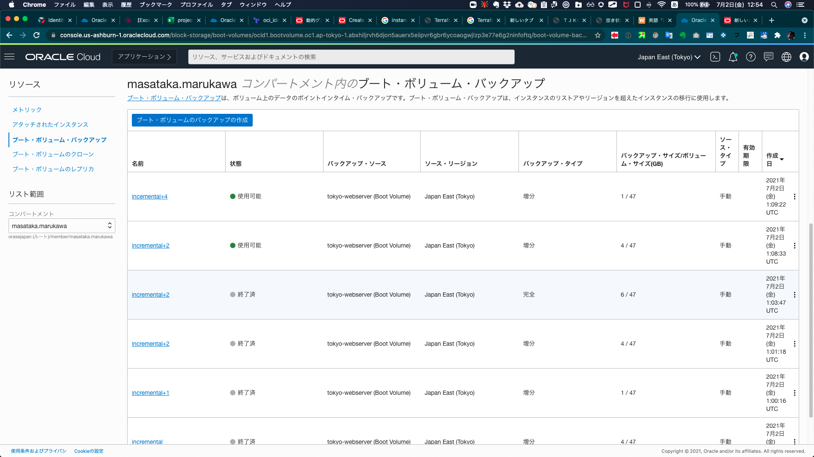

<!-- 同じディレクトリのイメージをおく場合のサンプルコード 

-->

一般的なOracle Cloud InfrastructureのFAQはサービスの公式ページにも記載されていますのでご覧ください。

# コンソールにログインできないのですがどうしたらいいでしょうか？

**質問**

ブラウザからコンソールのURLにアクセスしたのですがページが表示されません。

**回答**

まずはクラウド・アカウント名、ユーザー名、パスワードが正しいかを確認してください。ログイン方法は XXXや、[Oracle Cloud Infrastructureドキュメント : コンソールのサインイン](https://docs.oracle.com/ja-jp/iaas/Content/GSG/Tasks/signingin.htm) を参考にしてください。

問題の切り分けや対処として、以下の対応が考えられます。

1. [Oracle Cloud Infrastructureドキュメント : サポートされているブラウザ](https://docs.oracle.com/ja-jp/iaas/Content/GSG/Tasks/signingin.htm#Supporte){:target="_blank"} を確認し、サポートされているブラウザをご利用ください。
2. サポートされている他のブラウザでも同様の問題が発生するかどうかを確認します。

    どのブラウザでも問題が発生する場合
    - クライアントが利用しているネットワークのファイアーウォール設定やPCのセキュリティ設定でコンソールURLにアクセス可能かどうかを確認してください。
    - クライアントPCの時刻設定が正しいか確認してください。PCの時刻がずれている場合は正しく設定して下さい。コンソールからは内部的にAPIリクエストが発行されます。この際、クライアント側の時刻とのずれが大きいとAPIが正しく実行できません。

    特定のブラウザのみで問題が発生する場合
    - プライベートモード（シークレットモード）でログインする
    - キャッシュのクリア

上記を実施しても解決しない場合はサポートにSRを起票してください。

# コンピュート・インスタンスにsshでログインができません。

**質問**

Linuxのコンピュート・インスタンスを作成しましたが、クライアントからsshでのログインができません。

**回答**

問題の切り分けや対処として、以下の対応が考えられます。

- クライアント側でお使いのネットワークのファイアーウォール設定でsshの通信が許可されているかを確認してください。  
    必要に応じてsshの通信を許可してください。不明な場合はネットワーク管理者の方にご確認ください。

- クライアント側ネットワークでプロキシサーバーを経由する必要があるか確認してください。  
    プロキシサーバーの経由が必要な場合は、sshクライアント・ソフトウェアに適切にプロキシ設定を行ってください。不明な場合はネットワーク管理者の方にご確認ください。  
     (例) Tera Term の場合は、メニュー 設定 → プロキシ から設定

- OCI上でコンピュート・インスタンスを配置しているサブネットの設定を確認します。手順は XXX を参考にしてください。  
    サブネットに設定されているセキリティ・リストのセキュリティ・ルールに以下のイングレス・ルールが存在するかを確認してください。ない場合はルールを追加してください。  
    - ステートレス：いいえ
    - ソース：0.0.0.0/0
    - IPプロトコル：TCP
    - ソース・ポート範囲：All
    - 宛先ポート範囲：22

- インスタンスのIPアドレスに対してpingが応答するかを確認します、**デフォルトではインスタンスへのpingは通らない**設定になっていますので、セキュリティ・リストで以下の修正を行います、手順は を参考にしてください。  
    サブネットに設定されているセキュリティ・リストのセキュリティ・ルールで、以下のイングレス・ルールを編集します。
    - ステートレス：いいえ
    - ソース：0.0.0.0/0
    - IPプロトコル：ICMP
    - タイプとコード：3, 4 (デフォルト) → All

    上記のタイプとコードをAllに修正後、クライアント側からインスタンスのIPアドレスに対してpingを実行します。正しく応答が返ってくる場合は、ネットワークは到達できていますが、sshでのログインに問題があることがわかります。

- カスタム・イメージをご利用の場合はOSの設定でsshが許可されているかを確認してください。オラクル提供イメージから作成したLinuxインスタンスの場合はデフォルトでsshは許可されています。

上記を実施しても解決しない場合はサポートにSRを起票してください。

# インスタンスに関する計画メンテナンス通知を受け取った場合、どのようなことを理解しておくべきですか?

**質問**

コンピュート・インスタンスの計画メンテナンスのお知らせメールが届きました。または、コンソール上で計画メンテナンスの通知が表示されています。どのようなことを理解しておけばいいでしょうか?

**回答**

稼働中のインスタンスに影響するサーバーなどのインフラコンポーネントの計画メンテナンスをする必要がある場合、事前に通知がおこなわれ、コンソール上のお知らせページでの表示と管理者にメールが送信されます。  
該当のインスタンスの詳細ページを確認すると、メンテナンス実施に関する項目が表示されており、通常14~16日後にメンテナンス作業の予定実施日時が記載されています。  

もし、通知に記載された予定日時までの間に、ユーザーが何のアクションも起こさなかった場合は、その日時にインスタンスが新しいホストに移行します。  
もし、インスタンスがライブ・マイグレーションをサポートしているシェイプの場合は、移行はライブ・マイグレーションによって実施され、インスタンスが起動中ステータスのまま新しいホスト移行が完了します。  
もし、インスタンスがライブ・マイグレーションをサポートしていないシェイプの場合は、ホストの移行はリブート・マイグレーション(再起動移行)によって実施され、短いダウンタイムを伴います。  
ライブ・マイグレーション対象のシェイプは、[Oracle Cloud Infrastructureドキュメント : Live Migration](https://docs.oracle.com/en-us/iaas/Content/Compute/Tasks/movinganinstance.htm#live-migration) をご確認ください。  
リブート・マイグレーションの実施に当たっては、事前に注意しておくべき内容が [Oracle Cloud Infrastructureドキュメント : Prerequisites for Reboot Migration](https://docs.oracle.com/en-us/iaas/Content/Compute/Tasks/movinganinstance.htm#prerequisites-reboot) にありますので、こちらもご確認ください。

また、ユーザーは、通知に記載された予定日時よりも前の任意のタイミングで新しいホストへのインスタンスの移行を実施したり、スケジュールを行うことができます。

ベアメタル・インスタンスやローカルNVMeを内蔵するDenseIO、HPCなどのシェイプは、ライブ・マイグレーションやリブート・マイグレーションによって別のホストにインスタンスを移動して稼働を継続させることができず、手動で内蔵データの移行作業を行う必要がある場合があります。詳細は、[Oracle Cloud Infrastructureドキュメント : 手動移行によるインスタンスの移動](https://docs.oracle.com/ja-jp/iaas/Content/Compute/Tasks/movinganinstance.htm#manual){:target="_blank"} をご参照ください。

# インスタンスの状態が変化した時にメール通知を受け取ることができるようにするにはどうすればいいですか？

**質問**

コンピュート・インスタンスの状態が変化（起動、終了、シェイプ変更などのインスタンスの更新など）した際にメール通知を受け取りたいです。どのように設定すればいいでしょうか?

**回答**

[イベント(Event)サービス](https://www.oracle.com/jp/cloud-native/events-service/){:target="_blank"} でインスタンスの状態の変化を捉え、 [通知(Notification)サービス](https://www.oracle.com/jp/devops/notifications/){:target="_blank"} に連携してユーザーに通知します。
コンピュート・インスタンスにおいて状態変化に応じて生成できるイベントのタイプは [Oracle Cloud Infrastructureドキュメント : イベントを生成するサービス](https://docs.oracle.com/ja-jp/iaas/Content/Events/Reference/eventsproducers.htm){:target="_blank"} のコンピュートの項を参照してください。

**手順概要**
1. [Oracle Cloud Infrastructureドキュメント : イベントの開始](https://docs.oracle.com/ja-jp/iaas/Content/Events/Reference/eventsproducers.htm){:target="_blank"} に従って、通知先となる トピックとサブスクリプション を作成します
1. 続いて以下の内容のイベントのルールを作成します。
    - ルール条件
        - サービス名：Compute
        - イベント・タイプ：通知したいイベントを選択  
            インスタンスの起動や停止を通知したい場合は、Instance - Action Begin、Instance - Action End を選択します。
    - アクション
        - アクション・タイプ：通知
        - 通知コンパートメント：手順1で作成したトピックのあるコンパートメントを指定
        - トピック：手順1で作成したトピックを指定

# コンピュート・インスタンスに永続的なパブリック IP アドレスを関連付ける方法について教えてください。

**質問**
コンピュート・インスタンスの終了後、同一のパブリック IP アドレスを別のコンピュート・インスタンスに関連付けたいと考えています。永続的なパブリック IP アドレスをコンピュート・インスタンスに関連付けるにはどうしたら良いですか。

**回答**
OCI のパブリック IP アドレスには、エフェメラル・パブリック IP アドレスと、予約済みパブリック IP アドレスの２種類が存在します。永続的なパブリック IP アドレスを利用したい場合、予約済みパブリック IP アドレスを取得します。

- **エフェメラル・パブリック IP アドレス : **  
    インスタンスの存続期間中のみ保持される、一時的なパブリック IP アドレスです。インスタンスの起動・停止で変更されることはありません。

- **予約済みパブリック IP アドレス : **  
    割り当てられているインスタンスの存続期間を超えて永続的に保持可能なパブリック IP アドレスです。割り当てを解除し、いつでも好きなときに別のインスタンスに再割り当てすることができます。

予約済みパブリック IP アドレスを取得し、コンピュート・インスタンスに割り当てるには、以下の手順を実行します。

1. [Oracle Cloud Infrastructureドキュメント : プールに新規予約済パブリックIPを作成するには](https://docs.oracle.com/ja-jp/iaas/Content/Network/Tasks/managingpublicIPs.htm#console-reserved){:target="_blank"} を参考に、予約済みパブリック IP アドレスを取得します。

2. [Oracle Cloud Infrastructureドキュメント : プライベートIPに予約済パブリックIPを割り当てるには](https://docs.oracle.com/ja-jp/iaas/Content/Network/Tasks/managingpublicIPs.htm#console-reserved){:target="_blank"} を参考に、コンピュート・インスタンスのアタッチされた VNIC に、取得した予約済みパブリック IP アドレスを割り当てます。

既にコンピュート・インスタンスに エフェメラル・パブリック IP アドレス、または、予約済みパブリック IP アドレスが割り当てられている場合は、事前に対象のパブリック IP アドレスを削除する必要があります。詳細は [Oracle Cloud Infrastructureドキュメント : インスタンスからエフェメラル・パブリックIPを削除するには](https://docs.oracle.com/ja-jp/iaas/Content/Network/Tasks/managingpublicIPs.htm#console-ephemeral){:target="_blank"} または  [Oracle Cloud Infrastructureドキュメント : 予約済パブリックIPを割当て解除してプールに戻すには](https://docs.oracle.com/ja-jp/iaas/Content/Network/Tasks/managingpublicIPs.htm#console-reserved){:target="_blank"} 予約済みパブリック IP アドレスの割り当てを解除する をご参照ください。

# コンピュート・インスタンスにセカンダリ VNIC を追加するにはどうしたらよいですか?

**質問**

コンピュート・インスタンスを複数の VCN 内のサブネットに接続させたいと考えています。セカンダリ VNIC はどのように追加できますか？

**回答**

セカンダリ VNIC は、コンピュート・インスタンスの起動後にのみ追加可能です。  
インスタンスにアタッチできる VNIC の数には制限があり、シェイプによって異なります。これらの制限については、[Oracle Cloud Infrastructureドキュメント : コンピュート・シェイプ](https://docs.oracle.com/ja-jp/iaas/Content/Compute/References/computeshapes.htm){:target="_blank"} を参照してください。

セカンダリ VNIC を追加するには、以下の手順を実行します。
1. 対象のコンピュート・インスタンスにセカンダリ VNIC を作成します。
    [Oracle Cloud Infrastructureドキュメント : セカンダリVNICを作成してアタッチするには](https://docs.oracle.com/ja-jp/iaas/Content/Network/Tasks/managingVNICs.htm#console){:target="_blank"}
    
1. セカンダリ VNIC を作成後、コンピュート・インスタンスの種類によっては、OS へ認識させるために構成する必要があります。
    Linux VM インスタンスでは OS によって自動的にセカンダリ VNIC が認識されます
    Linux BM インスタンスでセカンダリ VNIC を構成する
Windows インスタンスでセカンダリ VNIC を構成する

# コンピュート・インスタンス用にセカンダリプライベート IP アドレスを設定するにはどうすればよいですか?

**質問**

コンピュート・インスタンスに、セカンダリプライベート IP アドレスを設定したいと考えています。どうすればよいですか？

**回答**

セカンダリ・プライベート IP アドレスは、既存のコンピュート・インスタンスのプライマリ VNIC、またはセカンダリ VNIC に追加することが可能です。
セカンダリ・プライベートIPアドレスは、VNICサブネットのCIDRから取得する必要があります。
両方のVNICが同じサブネットに属している場合、セカンダリ・プライベートIPをあるインスタンスのVNICから別のインスタンスのVNICに移動できます。
セカンダリプライベート IP アドレスを取得し、コンピュート・インスタンスに割り当てるには、以下の手順を実行します。
※詳細な手順は、「チュートリアル : Oracle Cloud Infrastructure を使ってみようチュートリアル」の記事でも紹介しております。
コンピュート・インスタンスにアタッチされた VNIC にセカンダリ・プライベート IP アドレスを割り当てます。
新しいセカンダリ・プライベート IP アドレスを VNIC に割り当てるには
セカンダリ・プライベート IP を VNIC に割り当てた後、OS がその IP アドレスを使用するよう構成する必要があります。
Linux でセカンダリ・プライベート IP アドレスを構成する
Windows でセカンダリ・プライベート IP アドレスを構成する

# コンピュート・インスタンスのバックアップにはどのような方法がありますか? また、自動化には どのような方法がありますか?

**質問**

コンピュート・インスタンスのバックアップを作成したいと考えています。バックアップにはどうような方法がありますか？また、自動化はどのような方法がありますか？

**回答**

コンピュート・インスタンスのバックアップには、カスタム・イメージの作成、または、ブート・ボリュームのバックアップ機能が利用できます。
ブート・ボリュームは、Oracle Cloud Infrastructure ブロック・ボリュームのバックアップ機能を使用して、バックアップを作成することができ、ブロック・ボリュームのバックアップ機能と同じく、バックアップポリシーによって自動化することが可能です。
コンピュート・インスタンスにブート・ボリューム以外のブロック・ボリュームをアタッチしている場合は、別途ブロック・ボリュームのバックアップが必要です。
カスタム・イメージの作成、および、ブート・ボリュームのバックアップの使い分けについては、こちらの資料をご参照ください。
カスタム・イメージを作成するには、以下の手順を実行します。
対象のコンピュート・インスタンスからカスタム・イメージの作成を行います。
カスタム・イメージを作成するには
実行中のインスタンスのイメージを作成すると、インスタンスはシャットダウンし、数分間使用できなくなります。プロセスが完了すると、インスタンスが再起動されます。
ブート・ボリュームのバックアップ作成、およびリストアを行うには、以下の手順を実行します。
※詳細な手順は、「チュートリアル : Oracle Cloud Infrastructure を使ってみようチュートリアル」の記事でも紹介しております。
対象のコンピュート・インスタンスのブート・ボリュームから手動バックアップの作成を行います。
ブート・ボリュームのバックアップ
作成したブート・ボリューム・バックアップからブート・ボリュームの作成を行います。
ブート・ボリュームのリストア
インスタンスの再作成を行う場合は、リストアしたブート・ボリュームからインスタンスの再作成を行います。
既存のインスタンスへアタッチする場合は、対象のコンピュート・インスタンスのブート・ボリュームをデタッチした上で、リストアしたブート・ボリュームをアタッチします。
ブート・ボリュームのデタッチ
ブート・ボリュームのアタッチ
バックアップはオブジェクトストレージに保持されるため、容量に応じたコストがかかります。
ブート・ボリュームのバックアップを自動化するには、以下の手順を実行します。
自動化したいブート・ボリュームにバックアップ・ポリシーの割り当てを行います。
ボリュームへのバックアップ・ポリシー割り当ての管理

# 既存の コンピュート・インスタンス を 別の 可用性ドメイン に移動させるにはどうすればよいですか?

**質問**

既存のコンピュート・インスタンスを、別の可用性ドメインに、移動、またはコピーする必要があります。どうすれば良いですか？

**回答**

既存のインスタンスを別の可用性ドメインに移動することはできません。代わりに、対象のコンピュート・インスタンスからブート・ボリュームのバックアップを作成し、手動でコンピュート・インスタンスを目的の可用性ドメインに移動できます。
コンピュート・インスタンスを別の可用性ドメインに移動させるには、以下の手順を実行します。
コンピュート・インスタンスのバックアップを取得します。
ブート・ボリュームのバックアップ
作成したブート・ボリューム・バックアップからブート・ボリュームの作成を行い、その際に移動させたい可用性ドメインを選択します。
ブート・ボリュームのリストア
リストアしたブート・ボリュームからインスタンスの再作成を行います。

# 既存の コンピュート・インスタンス を 別の サブネット に移動させるにはどうすればよいですか?

**質問**

既存のコンピュート・インスタンスを、別のサブネットに、移動、またはコピーする必要があります。どうすれば良いですか？

**回答**

既存のインスタンスを別のサブネットに移動することはできません。代わりに、対象のコンピュート・インスタンスからカスタム・イメージの作成を行い、オブジェクト・ストレージを介して、目的のサブネットへ手動で移動することができます。
コンピュート・インスタンスを別のサブネットに移動させるには、以下の手順を実行します。
対象のコンピュート・インスタンスからカスタム・イメージの作成を行います。
カスタム・イメージを作成するには
作成したカスタム・イメージをエクスポートします。
イメージのエクスポート
※オブジェクト・ストレージのバケットは、移動先のサブネットが参照可能なバケットをお使いください。
作成したカスタム・イメージをインポートします。
イメージの読み込み

# 既存の コンピュート・インスタンス を 別の OCI リージョン にコピーするにはどうすればよいですか?

**質問**

コンピュート・インスタンスのコピーを起動して、他の OCI リージョンにサービスを提供し、アプリケーションに冗長性を持たせたいと考えています。コンピュート・インスタンスのバックアップを作成し、それを別の OCI リージョンにコピーするには、どうすればよいですか？

**回答**

別の OCI リージョンに 既存のコンピュート・インスタンスのバックアップ をコピーするには、対象のコンピュート・インスタンスからカスタム・イメージの作成を行い、オブジェクト・ストレージを介して、目的の OCI リージョンへエクスポートする必要があります。
コンピュート・インスタンスを別の OCI リージョンに移動させるには、以下の手順を実行します。
対象のコンピュート・インスタンスからカスタム・イメージの作成を行います。
カスタム・イメージを作成するには
作成したカスタム・イメージをエクスポートします。
イメージのエクスポート
※オブジェクト・ストレージのバケットは、移動先リージョンで作成したバケットをお使いください。
作成したカスタム・イメージをインポートします。
イメージの読み込み

# 既存の コンピュート・インスタンス を 別の OCI テナンシー に 共有するにはどうすればよいですか?

**質問**

既存のコンピュート・インスタンスを別の OCI テナンシーへコピーしたいと考えています。どうすればよいですか？

**回答**

別の OCI テナンシーに 既存のコンピュート・インスタンスを共有するには、対象のコンピュート・インスタンスからカスタム・イメージの作成を行い、オブジェクト・ストレージを介して、目的の OCI テナンシーへエクスポートする必要があります。
コンピュート・インスタンスを別の OCI テナンシーに移動させるには、以下の手順を実行します。
対象のコンピュート・インスタンスからカスタム・イメージの作成を行います。
カスタム・イメージを作成するには
作成したカスタム・イメージをエクスポートします。
イメージのエクスポート
※オブジェクト・ストレージのバケットは、共有先の OCI テナンシーが参照可能なバケットをお使いください。
作成したカスタム・イメージをインポートします。
イメージの読み込み