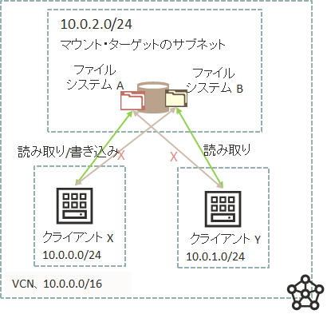

# ファイル・ストレージに接続するインスタンスを制限するにはどうすればいいですか？

## 質問

ファイル・ストレージに特定のインスタンスからのみ接続を許可する制御を行いたいです。どのように設定したらよいでしょうか？

## 回答

ファイル・ストレージへアクセスするインスタンスを制限するには、以下の2つのレイヤーでの制御方法があります。

- **セキュリティ・ルール**（VCN内のセキュリティ・リストやネットワーク・セキュリティ・グループで設定）
  - VCNのネットワーク上の仮想ファイアウォール機能
  - 特定のCIDRブロックやVNICから、また、特定のプロトコルとポートの通信を許可する
  - 参考：[Oracle Cloud Infrastructureドキュメント : セキュリティ・ルール](https://docs.oracle.com/ja-jp/iaas/Content/Network/Concepts/securityrules.htm)
- **エクスポート・オプション**
  - ファイル・システムのエクスポートごとに設定。つまり、同一のマウント・ターゲットであっても、ファイル・システムごとに別々の権限が設定できるので、セキュリティ・ルールよりも細かい制御が可能。
  - ファイル・システム単位でどのCIDRブロックのアクセスを許可するか、また、アクセスオプション（Read/Write, Read Onlyなど）を制御
  - 参考：[Oracle Cloud Infrastructureドキュメント : エクスポート・オプション](https://docs.oracle.com/ja-jp/iaas/Content/File/Tasks/exportoptions2.htm)

ここではエクスポート・オプションの利用例と設定方法を記載します。

- **エクスポート・オプションの利用例**
    - 10.0.0.0/24 に割り当てられたクライアント X は、ファイル・システム A に対する読み取り/書き込み権限が必要だが、ファイル・システム B に対しては必要ない。
    - 10.0.1.0/24 に割り当てられたクライアント Y は、ファイル・システム B への読み取り権限が必要だが、ファイル・システム Aにはアクセスしない。
    - ファイル・システム A と B の両方が単一のマウント・ターゲットに関連付けられている。

    

- **エクスポート・オプションの設定方法**
    1. 必要なセキュリティ・ルールが設定されて通信自体が許可されていることを確認。
    2. ファイル・システムのエクスポートの設定
       1. ファイル・ストレージ → ファイル・システム → ファイル・システム詳細 → 対象のエクスポートの 「**エクスポート詳細**」を開く
       2. 「**NFSエクスポート・オプションの編集**」 をクリック
          - ソース：接続を許可するNFSクライアントのIPアドレスまたはCIDRブロックを指定。
          - ポート：任意 / 特権。特権を選択すると、特権ソース・ポート（1-1023）からのみの接続を許可。
          - アクセス：読取り専用 / 読取り書込み。
       3. 「**更新**」 をクリック

**関連情報 :**  

- [Oracle Cloud Infrastructureドキュメント : NFSエクスポート・オプション](https://docs.oracle.com/ja-jp/iaas/Content/File/Tasks/exportoptions2.htm#Export)
- [Oracle Cloud Infrastructureドキュメント : セキュリティ・ルール](https://docs.oracle.com/ja-jp/iaas/Content/Network/Concepts/securityrules.htm#Security_Rules)

<br />

# ファイル・システムをマウントしましたが書き込みができないのはなぜですか？

## 質問

ファイル・システムを作成してクライアントのインスタンスからマウントしましたが、書き込みができません。どうしたらいいでしょうか？

## 回答

ファイル・システムへの書込みが失敗する場合、いくつかの原因が考えられますが、典型的な例はOSユーザーの権限不足です。ドキュメントのトラブルシューティングを参考に適切に権限を設定してください。

参考：[Oracle Cloud Infrastructureドキュメント : ファイル・システムへの書込みの失敗](https://docs.oracle.com/ja-jp/iaas/Content/File/Troubleshooting/cannotwrite.htm#Write_to_File_System_Fails)

**関連情報 :**  

- [Oracle Cloud Infrastructureドキュメント : ファイル・システムのトラブルシューティング](https://docs.oracle.com/ja-jp/iaas/Content/File/Concepts/troubleshootingfilesystems.htm)

<br />

# ファイル・システムのマウントが失敗するのはなぜですか？

## 質問

インスタンスからファイル・システムのマウントが失敗するのはなぜですか？

## 回答

ファイル・システムのマウントが失敗する場合、マウント・コマンドの情報、特にエクスポート・パスの情報が誤っている可能性があります。ドキュメントのトラブルシューティングを参考に、適切なマウントコマンドを実行してください。

参考：[Oracle Cloud Infrastructureドキュメント : マウント・コマンドの失敗](https://docs.oracle.com/ja-jp/iaas/Content/File/Troubleshooting/exportpaths.htm)

**関連情報 :**  

[Oracle Cloud Infrastructureドキュメント : ファイル・システムのトラブルシューティング](https://docs.oracle.com/ja-jp/iaas/Content/File/Concepts/troubleshootingfilesystems.htm)

<br />

# インスタンスからFSSへのデータのコピー、および FSS からインスタンスへのコピーを高速化するにはどうすればよいですか?

## 質問

インスタンスからファイル・ストレージへのデータのコピー、およびファイル・ストレージからインスタンスへのデータのコピーを高速化するにはどうすればいいですか？

## 回答

ファイル・ストレージの最大性能は、容量に応じて変動します。容量 1 TB あたり、読取り約100MB/sec、書込み約50MB/sec、約2,500 IOPS の性能となります。つまりファイル・ストレージに格納されているデータ量が多ければそれだけ全体の性能も向上します。

ただし、シリアル処理ではこのファイル・ストレージの最大性能を活かしきることはできません。シリアルで処理するのではなくパラレルで処理することで大量データのコピーなどの長時間かかる操作を高速化することが可能です。

並列処理を行うための手段として、ここでは2つの方法をご紹介します。

- File Storage Parallel Tools (fss-parallel-tools) を使用する

  - tar, rm, cp コマンドを並列化して実行するためのツール。クライアントOSにインストールして使用する。

    - `partar:` 並列でtarの作成と展開を行う
    - `parrm:` 並列でディレクトリ内を再帰的に削除
    - `parcp:` 並列でディレクトリ内を再帰的にコピー

  - 実行例

    - `parcp` を使用して、あるディレクトリから別のディレクトリに内容をコピーする。 `-P` オプションでパラレルスレッド数を設定する。

      ```
      $parcp -P 16 /source/folder /destination/folder
      ```

  - 詳細：[Oracle Cloud Infrastructureドキュメント : Using File Storage Parallel Tools](https://docs.oracle.com/ja-jp/iaas/Content/File/Tasks/using_file_storage_parallel_tools.htm#using_file_storage_parallel_tools)

- GNU Parallel を利用して並列化する

  - 実行例

    - GNU Parallel を使用した rsync の並列化

      ```
      time find /mnt/MyFileSystem -mindepth 1 -maxdepth 1 | parallel -P100 rsync --archive --perms --owner --group --xattrs --acls --recursive --delete --compress --exclude=.snapshot --ignore-errors --progress --log-file=$HOME/rsync/logs/test.log1 --quiet -e ssh {} root@10.0.3.6:/mnt/rsync_target
      ```

  - 詳細：[Oracle Cloud Infrastructureドキュメント : RSYNC is Slow When Copying Files](https://docs.oracle.com/ja-jp/iaas/Content/File/Troubleshooting/rsync_is_slow_copying_files.htm)

**関連情報 :**

- [File Storage Service Performance Guide](https://docs.oracle.com/en-us/iaas/Content/Resources/Assets/whitepapers/file-storage-performance-guide.pdf)
- [Using File Storage Parallel Tools](https://docs.oracle.com/en-us/iaas/Content/File/Tasks/using_file_storage_parallel_tools.htm#using_file_storage_parallel_tools)
