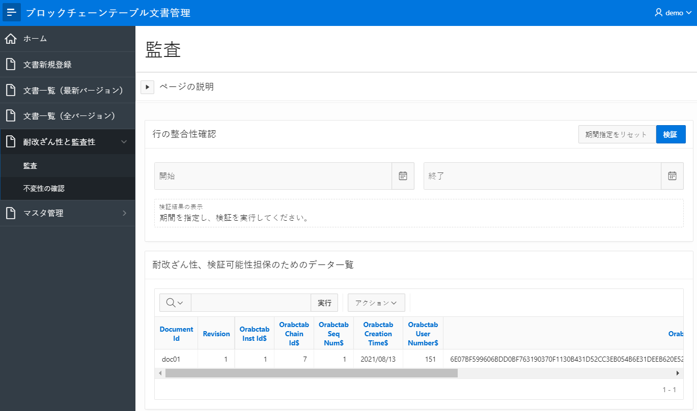

Oracle Databaseの機能のBlockchain Tableの特性を体験し、そのメリットを理解していただくためのサンプルアプリケーションを紹介します。

# ブロックチェーンテーブル文書管理サンプルアプリケーションの概要

このアプリケーションは、Oracle Databaseのブロックチェーンテーブルのふたつの特性―**耐改ざん性**と**監査性**―を、文書ファイルの管理（保管と検索、閲覧）のシナリオを通じて体験いただくためのサンプルです。

このブロックチェーンテーブル文書管理サンプルアプリケーションは、Oracle APEX（Application Express）で実装されています。そのため、Oracle Database上でアプリケーションを稼働させることができ、アプリケーション・サーバーなどの用意の必要なく利用することができます。このサンプルはまた、Oracle APEXの利便性とパワフルさを体験いただけるものにもなっています。


## ブロックチェーンテーブルでの文書管理

このアプリケーションでは、文書（のファイル）の管理というシナリオをブロックチェーンテーブルを活用して実装しています。
- WORD、PDF、Excel、テキストなど任意の形式の文書ファイルを保存可能です。
- ある文書についてのデータ（文書データ）は、文書ファイルそのものと、ドキュメントID、バージョン、ドキュメント名、登録者などのデータから成ります。
  - 文書データはブロックチェーンテーブルに保存され、登録後は更新不能です。
  - ひとつの文書（同一のドキュメントIDを付与された文書データ）に対してひとつ～複数のバージョンの文書データを管理可能です。
- また、文書のステータス、カテゴリー、備考から成る付加情報データを文書に付与できます。
  - 付加情報のデータは通常のテーブルに保存され、後から更新することができます。
  - 付加情報はひとつの文書に対してひとつです（複数バージョンが存在する場合も共通です）。

## 主な機能

文書管理に関わる機能と、ブロックチェーンテーブルの特性である耐改ざん性と監査性を体験するための機能を備えています。


- 文書管理に関わる機能
  - 文書データおよび付加情報の登録
  

  - 文書データの検索、一覧表示、文書のダウンロード
  

  - ある文書についての新バージョンの文書データの登録
  - 付加情報の更新
- 耐改ざん性と監査性に関わる機能
  - ブロックチェーンテーブルの行の整合性検証（ハッシュチェーンの検証）
  

  - ブロックチェーンテーブル上の文書データのUPDATE、DELETE不能の確認
  

# ダウンロードとインストール、実行方法

## 前提：必要な環境と準備

- **ブロックチェーンテーブルの利用可能なOracle Database**
  - アプリケーション内でブロックチェーンテーブルを利用するため、ブロックチェーンテーブルをサポートしているバージョンのOracle Databaseが必要です。
  - 2021/9/29時点では、主な選択肢として以下いずれかで利用可能です。
      - Oracle CloudのAutonomous Database（Autonomous Data WarehouseあるいはAutonomous Transaction Processing）の**19c**バージョンまたは**21c**バージョンを利用する（注意：現在、Autonomous Databaseで21cのバージョンを選択できるのは、Always Free枠のみです）。
      - Oracle CloudのDatabase Cloud ServiceのOracle Databaseの**19cのRU11以降のバージョン**を利用する。
      - オンプレミス／IaaSなどに自身で構築したOracle Databaseの**19cのRU11以降、または21cのバージョン**を利用する。

- **Oracle APEXの利用準備**
  - このアプリケーションはOracle APEXアプリケーションとして実装されているため、稼働環境のデータベースのOracle APEXをセットアップしておく必要があります。また、利用している機能との互換性の関係で、**Oracle APEX 20.2以降のバージョン**が必要です。
    - Autonomous Databaseでは、Oracle APEXはデフォルトで有効化され、利用可能な状態になっています。
    - Database Cloud Serviceや、自身で構築したOracle Databaseを利用する場合には、Oracle APEXをインストールし、セットアップしてください。

## サンプルアプリケーションのダウンロード

<a href="{{ "/solutions/blockchain/blockchain-table-document-sample/BlockchainTable_Document_Sample.sql" | relative_url }}">こちらからダウンロードください</a>

## サンプルアプリケーションのインストール（作業所要時間：5分程度）

ダウンロードしたアプリケーションをOracle APEXでインポートすることでアプリケーションが利用可能になります。
- インストールする対象のAPEXワークスペースで、「アプリケーション・ビルダー」の画面のメニューから「インポート」を選択し、表示されるガイドに従ってインポートしてください。オプションはデフォルトのままでOKです。
  

  

  

  

- **サンプルアプリケーション専用に新規のAPEXワークスペースを作成することを推奨**します。
- アプリケーションのインストールプロセスの一部として、必要なテーブル、ビューなどのデータベース・オブジェクトも作成されます。

## サンプルアプリケーションの実行

インストールしたアプリケーションはすぐに利用可能です。
- インストールしたAPEXワークスペースで、「アプリケーション・ビルダー」の画面のメニューから当該アプリケーションを選択します。
- 「アプリケーションの実行」を選択します。
- 別ウィンドウでログイン画面が表示されます。ワークスペース管理者のユーザー（また、ワークスペース内に他のユーザーを作成済であればそのユーザーでも可）でログインします。
- ログインに成功するとアプリケーション画面が表示されます。

# サンプルアプリケーションについてのTips

## カスタマイズ

インストールしたサンプルアプリケーションは、APEXのアプリケーション・ビルダーでカスタマイズが可能です。


## 利用しているテーブルやビュー


- アプリケーション内で利用しているテーブルやビューなどのデータベース・オブジェクトは、APEXのSQLワークショップのオブジェクト・ブラウザで確認したり、SQLコマンドで直接SQLを発行することができます。
  

- ブロックチェーンテーブルはテーブルの破棄（DROP）を制約、禁止できます。今回、アプリ内で使用しているブロックチェーンテーブル（DOCUMENT_BCTテーブル）は、利便性のためにDDLで```NO DROP UNTIL 0 DAYS IDLE```を指定しておくことで、いつでもDROP可能にしています。

## 監査ページの機能の詳細

アプリ内の監査ページでは　①ブロックチェーンテーブルの行の整合性検証（ハッシュチェーンの検証）　と　②ブロックチェーンテーブルの隠しカラムのデータの閲覧　が行えます。

- **ブロックチェーンテーブルの行の整合性検証（ハッシュチェーンの検証）**<br>
  ブロックチェーンテーブルには、保存された行のハッシュ値のチェーンを検証することにより、行がINSERT以降に改ざん、削除などされていないかを確認する機能が備わっています。この機能は、```DBMS_BLOCKCHAIN_TABLE.VERIFY_TABLE_BLOCKCHAIN```プロシージャを実行することにより利用可能で、サンプルアプリ内でもこれを呼び出しています。このプロシージャの利用方法について詳しくは[こちら](https://docs.oracle.com/en/database/oracle/oracle-database/21/admin/managing-tables.html#GUID-F4275F22-3A9E-4A78-BF80-0FB43A909A8B)を参照ください。

- **ブロックチェーンテーブルの隠しカラムのデータの閲覧**<br>
  ブロックチェーンテーブルでは、行のハッシュ値、行のINSERT時刻などの耐改ざん性、監査性担保のための情報が行のINSERT時に自動的に保存されます。どのような情報が隠しカラムに保存されるのかについて詳しくは[こちら](https://docs.oracle.com/en/database/oracle/oracle-database/21/admin/managing-tables.html#GUID-02BD6C35-E1E9-41B7-BD56-68C7A667B51F)を参照ください。

# 参考ドキュメント、リンクなど

- [APEXのインストーラのダウンロード・ページ](https://www.oracle.com/jp/tools/downloads/apex-downloads.html)
- [APEX構築の参考ページ1：Oracle Application Express［環境構築編］（1）インストール](https://www.ydc.co.jp/solution/standby/article/oracle_apex_1.html)
- [APEX構築の参考ページ2：terraformでAPEXをDBaasにインストールする手順](https://fullenergy.co.jp/tech-blog/apex_on_oci_database/)
- [APEX構築の参考ページ3：DBCSにAPEXをインストールしてみた How to install APEX on DBCS](https://itedge.stars.ne.jp/oci-dbaas-apex18/)
- [APEX構築の参考ページ4：Oracle Cloud Infrastructure（OCI）の Database Cloud Service（DBCS）に Oracle Application Express（APEX）を構築してみた](https://qiita.com/ayamakkk/items/e150b485fc64997b40bc)
- [Oracle Database 21cの公式ドキュメントのBlockchain Table関連の箇所](https://docs.oracle.com/en/database/oracle/oracle-database/21/admin/managing-tables.html#GUID-43470B0C-DE4A-4640-9278-B066901C3926)